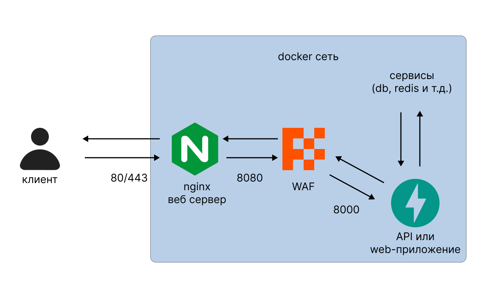

<p align="center">
  
</p>
<p align="center">
    <em>FireBox - Web Application Firewall (WAF)  </em>
</p>

---
## Обзор

Firebox - инструмент для веб разработчиков, призванный повысить безопасность и производительность приложения за счет интеллектуального управления запросами


## Пример архитектуры

Firebox работает как реверс прокси между веб-сервером и самим приложением

<p align="center">
  
</p>


## Пример запуска
```
python firewall.py -p 8000 -tp hostname:8000 -v -ml -sg -rt 60:50
```


```
options:
  -h, --help            show this help message and exit
  -p PORT, --port PORT  Port for reverse proxy
  -tp TARGET_HOST, --target-host TARGET_HOST
                        Target application port
  -v, --verbose         Enable verbose output for debugging
  --timeout TIMEOUT     Timeout for requests in seconds (default: 30)
  -ml, --machine-sec    Enable machine learning security (default: False)
  -sg, --signature-sec  Enable signature security (default: False)
  -rt RATE_LIMIT, --rate-limit RATE_LIMIT
                        Enable ddos rate-limit security (default: False) Expl 60:50 ->
                        ttl:max_req_len

```